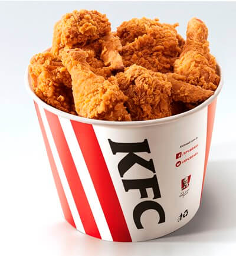
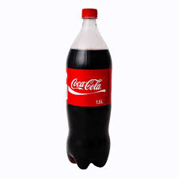

<!DOCTYPE html>
<html lang="pt-br">
	<head>
		<meta charset="UTF-8">
		<meta name="viewport" content="width=device-width, initial-scale=1.0">
		<title>Felipe de França </title>
	</head>
	<body>
		<h1><mark style="background-color:blue">Programação (Matemática II)</mark></h1>
		<h1><mark style="background-color:red">Exercício 3 Segundo Trimestre</mark></h1>
		<h1>Minhas Férias</h1>
		<ol>
			<li>Onde fui:
				<ul>
					<li>Fui na casa do Eduardo  
                                              
				</ul>
			<li>O que comi:
				<ul>
					<li>Bolinho de arroz;
					
					<li>KFC.
					 
				</ul>
			<li>O que bebi:
				<ul>
					<li>Coca-Cola;
					
					<li>Água.
					
				</ul>
		</ol>
	</body>
</html>
